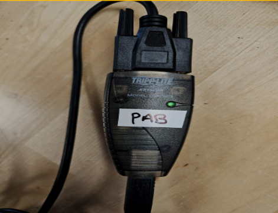
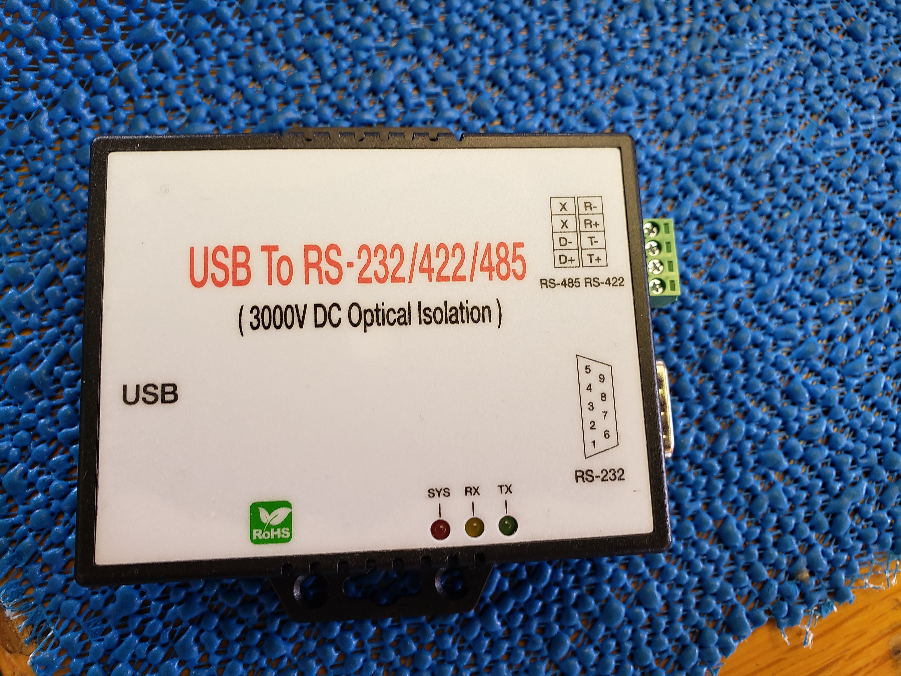

This page is for components (not full arrays)

# Configuring the GPS

**Configuring the computers to read the ship’s GPS**\
1. Use the serial to USB adapter cables (e.g. Keyspan Tripp-Lite), or the RS-232 GPS adapter

{fig-align="left" width="338"}

{fig-align="right" width="242"}

*For the Keyspan Tripp-Lite installation:*

```         
  1. Requires driver: USA-19HS Windows (2000, XP, 2003 Server, Vista)\_v3.7S  
  2. Make sure that Windows Security \> Device Security \> Core Isolation \> Core isolation details \> Memory integrity  \> Toggle the switch to “Off” otherwise the computer cannot install the driver (even with admin priviledges)  
```
*For the RS-232 installation:*
*add text here- to do by Jennifer or Shannon*

2.  Plug in the GPS USB AFTER the computer has been restarted otherwise will have the jumpy mouse problem
    1.  To resolve the jumping mouse, disconnect the GPS USB and you will probably have to log off or restart the computer. Once you have logged back in, reconnect the GPS USB\
    2.  If that doesn’t work, go to the device manager \> Mice and other pointing devices \> Microsoft serial ballpoint \> Uninstall\
3.  Use the Device Manager to make sure the USB-1280LS is registering under the COM port section\
4.  If you need to change the COM port within Pamguard, go to Settings \> NMEA parameters \> Serial settings \> Port\
5.  To confirm Pamguard is reading the incoming GPS data go to Settings \> NMEA data collection \> NMEA data strings (should see it update)
