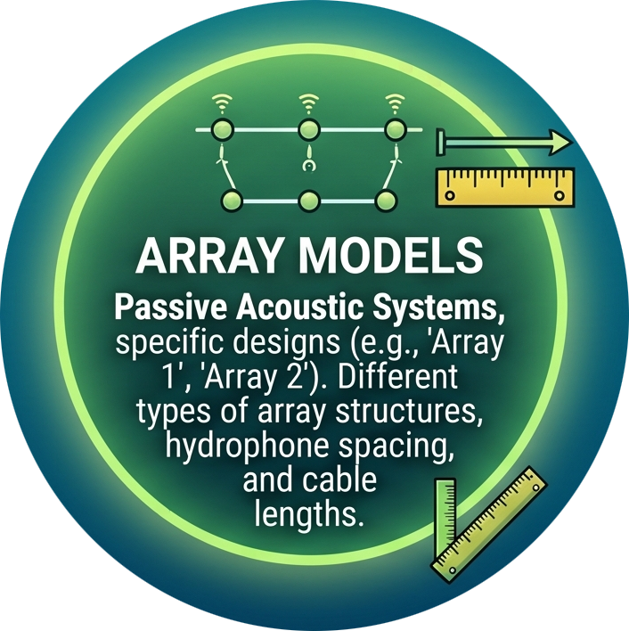

{fig-align="left" width="279"}

Towed hydrophone array models have evolved within NOAA over the last 25 years. Currently NMFS uses a [modular array](arrayModel_modular.qmd) system consisting of a minimum of six hydrophone elements.
